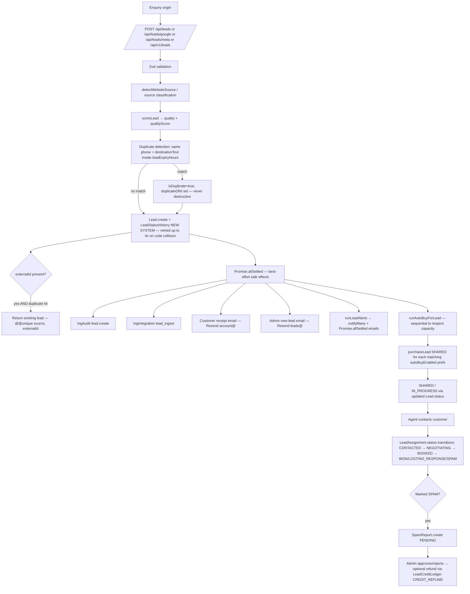
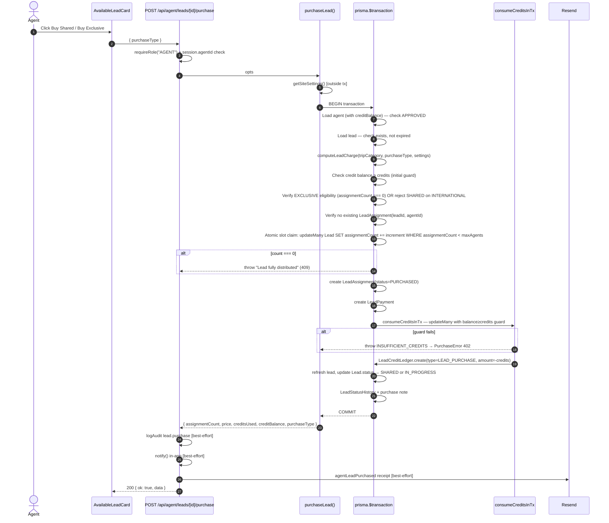
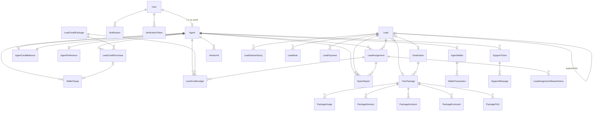
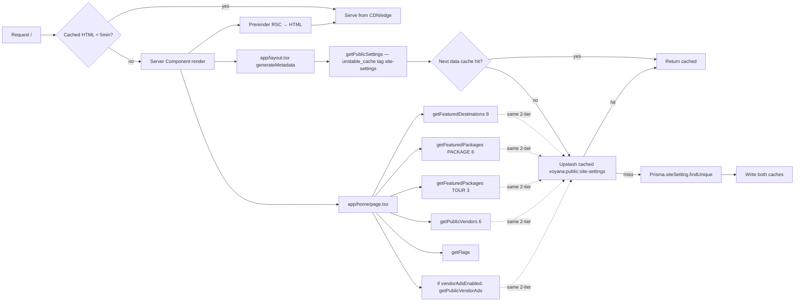

# MokshBooking — Architecture Diagrams

Mermaid diagrams for the overall system, lead lifecycle, purchase transaction, authentication, email pipeline, and database relationships. All derived from real code — no invented flows.

---

## 1. Overall system

```mermaid
flowchart TB
  subgraph Traffic
    Visitor[Public visitor]
    GoogleAds[Google Lead Forms]
    MetaAds[Meta Lead Ads]
    Partner[Partner via API key]
  end

  subgraph Vercel["Next.js on Vercel"]
    Site[/(home) + /(site) pages/]
    AgentPortal[/agent/(portal)/]
    AdminPanel[/admin/(panel)/]
    APILayer[/api/*  Route handlers/]
    Middleware[proxy.ts — Supabase session refresh]
  end

  subgraph Data
    Postgres[(Supabase Postgres)]
    Redis[(Upstash Redis)]
    Storage[(Supabase Storage — media)]
  end

  subgraph External
    SupaAuth[Supabase Auth]
    Resend[Resend Email]
    Razorpay[Razorpay legacy]
  end

  Visitor --> Site
  Site --> APILayer
  GoogleAds -->|POST /api/leads/google| APILayer
  MetaAds -->|POST /api/leads/meta| APILayer
  Partner -->|POST /api/v1/leads| APILayer

  AgentPortal --> APILayer
  AdminPanel --> APILayer
  Middleware --> APILayer

  APILayer -->|Prisma| Postgres
  APILayer -->|Prisma read via unstable_cache| Redis
  APILayer -->|Supabase JS SDK| SupaAuth
  APILayer -->|HTTP send| Resend
  APILayer -->|Webhook + admin.inviteUserByEmail replaced by generateLink| SupaAuth
  APILayer -->|Media library| Storage
  Razorpay -->|webhook| APILayer
```

---

## 2. Lead lifecycle



---

## 3. Lead purchase transaction (Shared / Exclusive)



---

## 4. Authentication + admin invite

```mermaid
flowchart TD
  Signup[Agent signup /agent/signup] --> SVal[Zod validate]
  SVal --> SCreate[Supabase admin.createUser + prisma.user.create + prisma.agent.create PENDING]
  SCreate --> SOTP[VerificationToken EMAIL_VERIFY + email OTP]

  Login[/api/auth/login] --> LSup[supabase.auth.signInWithPassword]
  LSup --> LGate{User.emailVerified?}
  LGate -->|no| LEV[Redirect /agent/verify-email]
  LGate -->|yes| L2FA{User.twoFactorEnabled?}
  L2FA -->|yes| L2FASend[Issue TWO_FA VerificationToken + email → /agent/verify-2fa]
  L2FA -->|no| Dashboard[Redirect to role dashboard]

  Forgot[Forgot password] --> FTok[VerificationToken PASSWORD_RESET 32-byte hex]
  FTok --> FMail[passwordResetEmail via Resend account@]
  FMail --> FReset[User clicks link → /agent/reset-password]
  FReset --> FConsume[Consume token + supabase.auth.admin.updateUserById]

  AdminInvite[Super Admin at /admin/admins] --> AIVal[Zod validate email + adminRole]
  AIVal --> AIDup{Email exists in User?}
  AIDup -->|yes| AIReject[409 duplicate]
  AIDup -->|no| AICreate[prisma.user.create role=ADMIN emailVerified=true]
  AICreate --> AILink[supabase.auth.admin.generateLink type=invite → action_link]
  AILink --> AIMail[sendEmail adminInviteEmail via Resend account@]
  AIMail -->|fail| AIRollback[Delete Supabase auth user + delete User row → 502]
  AIMail -->|ok| AIAudit[logAudit admin.invite]
  AIAudit --> AIClick[Invitee clicks link → Supabase authenticates → redirect /admin/set-password]
  AIClick --> AISet[Client supabase.auth.updateUser password → redirect /admin/dashboard]
```

---

## 5. Email pipeline

```mermaid
flowchart LR
  Trigger[Any server-side trigger] --> Mailer[sendEmail lib/email/mailer.ts]
  Mailer --> Env{RESEND_API_KEY set?}
  Env -->|no| DevLog[console.info dev-only, returns skipped:true]
  Env -->|yes| Resend[POST https://api.resend.com/emails]

  subgraph Templates
    T1[customerLeadReceived]
    T2[adminNewLead]
    T3[agentLeadPurchased]
    T4[agentAutoLeadPurchased]
    T5[agentLeadAlert]
    T6[agentApproved]
    T7[walletCredited]
    T8[verifyEmailCode]
    T9[twoFactorCode]
    T10[securitySettingsChanged]
    T11[supportTicketCreated]
    T12[supportTicketReply]
    T13[passwordResetEmail]
    T14[adminInviteEmail]
  end

  Templates --> Mailer

  subgraph Categories
    Verify[verify@ — OTP + verify email]
    Leads[leads@ — receipts + alerts]
    Bookings[bookings@ — booking confirmations]
    Support[support@ — tickets]
    Account[account@ — password reset + admin invite + security]
  end

  Mailer -->|per category| Categories
  Resend -->|failure| IntLog[logIntegration email FAILED]
```

Sender identity: `${BRAND_NAME} <${category}@${EMAIL_SEND_DOMAIN}>` — one verified domain, per-category local-part for filtering.

---

## 6. Database relationships (simplified)



---

## 7. Public page rendering + caching



Admin mutation → `revalidatePath("/") + revalidateTag(..., "max") + invalidateCache(...)` in [lib/cache/revalidate.ts](../lib/cache/revalidate.ts) → flushes both cache tiers.

---

## 8. RBAC decision map

```mermaid
flowchart TD
  Req[Request to /admin/**] --> Session[getSession]
  Session --> R{session?.role === "ADMIN"?}
  R -->|no| Redirect401[Redirect to /admin/login]
  R -->|yes| Area{route needs area?}
  Area -->|no| Allow[Render page]
  Area -->|yes| Check[canAccess session, area]

  Check --> Sub{session.adminRole}
  Sub -->|null| Allow[Treat as SUPER_ADMIN — legacy]
  Sub -->|SUPER_ADMIN| Allow
  Sub -->|LEAD_MANAGER| A1{area in [leads, vendors]?}
  Sub -->|SALES_MANAGER| A2{area in [leads, vendors]?}
  Sub -->|FINANCE_ADMIN| A3{area in [finance, vendors]?}
  Sub -->|SUPPORT_ADMIN| A4{area in [support, vendors]?}
  Sub -->|MARKETING_ADMIN| A5{area in [marketing, leads]?}
  Sub -->|CONTENT_ADMIN| A6{area in [content]?}

  A1 & A2 & A3 & A4 & A5 & A6 -->|no| Restricted[AccessRestricted card in-page]
  A1 & A2 & A3 & A4 & A5 & A6 -->|yes| Allow
```

Reference table from [lib/rbac.ts](../lib/rbac.ts):

| Role | Areas |
|---|---|
| `SUPER_ADMIN` | leads, finance, support, marketing, content, vendors, settings, flags |
| `LEAD_MANAGER` | leads, vendors |
| `SALES_MANAGER` | leads, vendors |
| `FINANCE_ADMIN` | finance, vendors |
| `SUPPORT_ADMIN` | support, vendors |
| `MARKETING_ADMIN` | marketing, leads |
| `CONTENT_ADMIN` | content |
